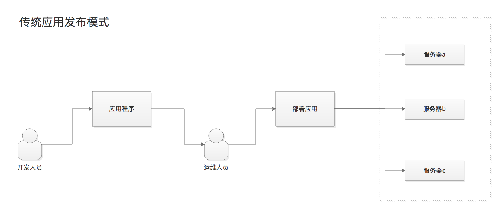
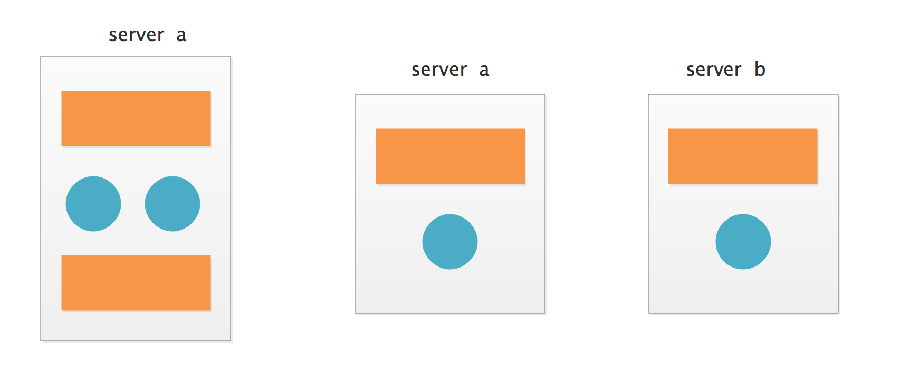

# 应用架构发展

大型单体应用被拆分成多个小型微服务

## 传统发布模式
- 开发人员手动打包
- 运维人员脚本部署
- 应用部署在多集群

## 单体应用
- 程序以单个进程或多个进程的方式运行
- 应用的发布周期较长
- 更新迭代速度更加缓慢

## 微服务
- 将程序分成小的并且可独立运行的组件
- 程序中各个组件之间解耦
- 每个组件可以独立开发与发布

## 微服务盛行之下遇到的问题

- 组件数量增多，如何保证配置管理？
- 如何保持系统正常运行？
- 如何将资源利用率最高？
- 手动部署是最难以解决的问题

## 微服务模式下我们需要什么？
- 自动化任务调度
- 自动化配置管理
- 自动化故障处理
- 弹性伸缩

这正是我们要学习的Kubernets的特性！

## 了解Kubernetes
- 使开发者自主部署应用，控制部署频率。
- 帮助运维同学在发生硬件故障时重新调度应用。
- 可以将k8s想像成整个基础设施，监管所有应用。

kubernetes帮助企业标准化云端部署和应用交付方式。

