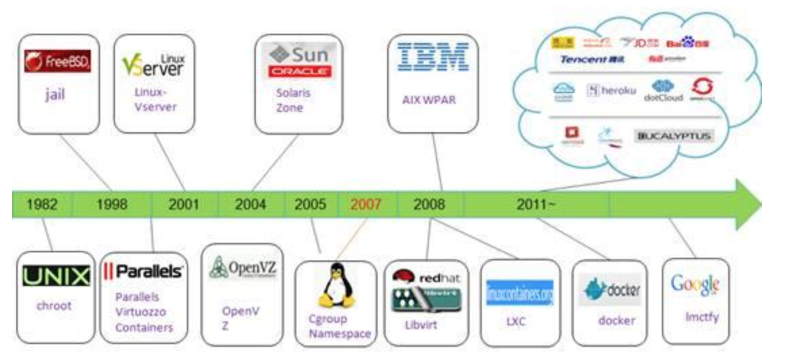
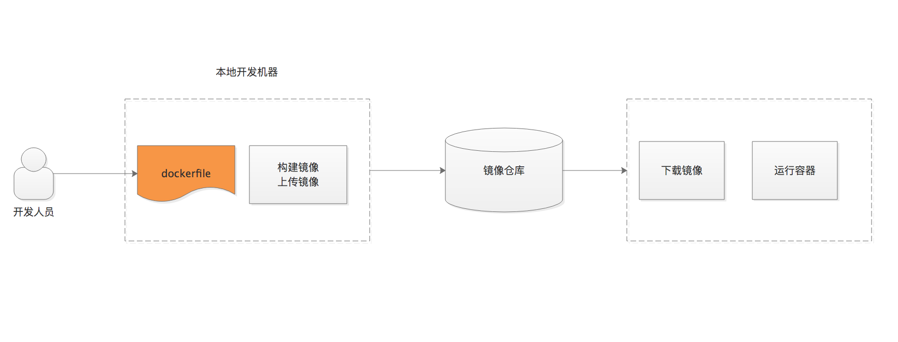

# 容器技术的盛行

## 什么是容器？
- 锅碗瓢盆？
- 容器（Linux Container）集装箱

容器是通过一种虚拟化技术来隔离运行在主机上不同进程，从而达到容器之间、容器和宿主操作系统相互隔离、互不影响。

## 容器发展史

- 轻量级虚拟化产品如OpenVZ、Linux-Vserver和Linux Chroot技术的出现为操作系统虚拟化和容器资源隔离打下了一定基础。
- 随着cgroup以及namespace合入Linux内核，容器技术得到Linux内核主线的支持。

## 容器的特点

- 轻量：只打包了必要的执行文件和库文件；
- 快速部署：根据镜像的不同，容器的部署大概在毫秒与秒之间；
- 易于移植：一次构建，随处部署；
- 弹性伸缩：Kubernetes、Swam、Mesos容器管理平台；

## Docker容器平台

- Docker是第一个使容器能在不同机器之间移植的系统
- 简化了打包应用的流程，简化应用的依赖管理

### 虚拟机移植
- 创建虚拟机
- 制作整个虚拟机镜像
- 分发虚拟机镜像

### Docker移植
- 制作镜像（只包含程序运行时依赖）
- 分发镜像

## Docker核心概念

- 镜像：应用程序打包和运行所需依赖的环境。（应用程序文件系统）

- 镜像仓库：存放Docker镜像的仓库，分为私有仓库和公开仓库。

- 容器：通过docker镜像实例化后为容器，资源隔离。

