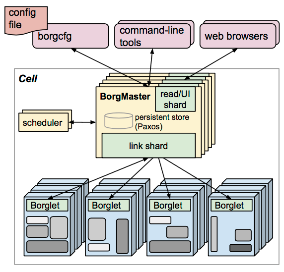

# 容器PAAS简介 

> 随着系统可部署组件的数量增长，管理会越来越困难。
需要一个更好的方式部署和管理组件，并实现弹性伸缩。

## Kubernetes概述

> Kubernetes（简称为 K8s），最初由 Google 的工程师开发和设计。Kubernetes 是用于自动部署、扩展和管理容器化应用程序的开源系统，它旨在提供跨主机集群的自动部署、扩展以及运行应用程序容器的平台。Kubernetes 支持一系列容器工具, 包括 Docker 等。

> Kubernetes这个词是“舵手”的希腊语，该项目是Google在2014年启动的。它由 Joe Beda，Brendan Burns和Craig McLuckie创建。Kubernetes v1.0在2015年7月21日正式发布，并且迅速贡献给Linux Foundation，作为Cloud Native Computing Foundation的一部分。

- Kubernetes是一个开源系统，用于容器化应用的自动部署、扩缩和管理。
- Kubernetes 将构成应用的容器按逻辑单位进行分组以便于管理和发现。
- Kubernetes 基于谷歌公司在运行生产负载上的 15 年经验 打造，并融合了来自社区的最佳建议与实践。

borg系统

## Kubernetes历史
> + 2003-2004: Borg 系统的诞生
> + 2013: 从 Borg 到 Omega
> + 2014: Google 推出 Kubernetes

> > + 6月7日：初始版本发布
> > + 7月10日：微软、RedHat、IBM、Docker 加入Kubernetes社区

> + 2015: Kubernetes v1.0 和 CNCF 的一年

> > + 7 月 21 日：Kubernetes v1.0 发布。

> + 2016: Kubernetes 在这一年成为主流

> > + 2 月 23 日：Kubernetes 软件包管理系统 Helm 首次发布。
> > + 7 月 11 日：Minikube 正式发布
> > + 12 月 21 日：Kubernetes 1.5 发布
> > + 12 月 23 日：Kubernetes 支持 OpenAPI

> + 2017:Docker 拥抱 Kubernetes。
> + 2018:Kubernetes1.10 测试版本发布。
> + 2019:Kubernetes1.15版本发布。

## Kubernetes核心功能

- 帮助开发者聚焦核心应用功能
- 帮助运维团队获取更高资源利用率

## Kubernetes集群架构

> + etcd保存了整个集群的状态；
> + apiserver提供了资源操作的唯一入口，并提供认证、授权、访问控制、API注册和发现等机制；
> + controller manager负责维护集群的状态，比如故障检测、自动扩展、滚动更新等；
> + scheduler负责资源的调度，按照预定的调度策略将Pod调度到相应的机器上；
> + kubelet负责维护容器的生命周期，同时也负责Volume（CVI）和网络（CNI）的管理；
> + Container runtime负责镜像管理以及Pod和容器的真正运行（CRI）；
> + kube-proxy负责为Service提供cluster内部的服务发现和负载均衡；

> 除了核心组件，还有一些推荐的Add-ons：

> + kube-dns负责为整个集群提供DNS服务
> + Ingress Controller为服务提供外网入口
> + Heapster提供资源监控
> + Dashboard提供GUI
> + Federation提供跨可用区的集群
> + Fluentd-elasticsearch提供集群日志采集、存储与查询

 
## Kubernetes分层架构

> + 核心层：Kubernetes最核心的功能，对外提供API构建高层的应用，对内提供插件式应用执行环境
> + 应用层：部署（无状态应用、有状态应用、批处理任务、集群应用等）和路由（服务发现、DNS解析等）
> + 管理层：系统度量（如基础设施、容器和网络的度量），自动化（如自动扩展、动态Provision等）以及策略管理（RBAC、Quota、PSP、NetworkPolicy等）
> + 接口层：kubectl命令行工具、客户端SDK以及集群联邦
> + 生态系统：在接口层之上的庞大容器集群管理调度的生态系统，可以划分为两个范畴
> + Kubernetes外部：日志、监控、配置管理、CI、CD、Workflow、FaaS、OTS应用、ChatOps等
> + Kubernetes内部：CRI、CNI、CVI、镜像仓库、Cloud Provider、集群自身的配置和管理等

