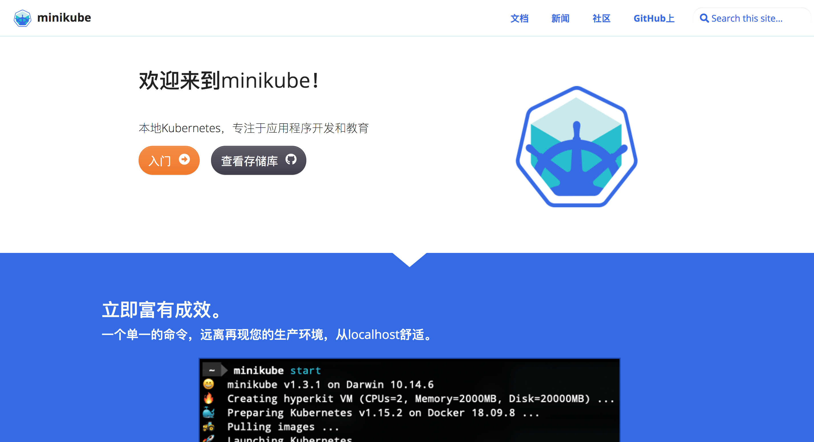

# 使用Minikube部署单节点集群


## Minikube简介
> 官网：https://minikube.sigs.k8s.io/
> minikube是运行kubernetes集群最简单、最快捷的途径。
> 对于测试kubernets和本地开发应用都非常有用。



## 准备工作
> 安装一台Centos7虚拟机，开启虚拟机的CPU虚拟化。


## 安装minikube
> 下载地址：
https://storage.googleapis.com/minikube/releases/latest/minikube-1.3.1.rpm

```bash
rpm -ivh minikube-1.3.1.rpm 
```

## 安装virtualbox(5.2+)

> 安装开发工具

```
#必须安装以下工具，否则会出现virtualbox问题。
yum -y install  gcc perl make kernel-devel  
```

> 添加virtualbox yum源

```
[virtualbox]
name=Oracle Linux / RHEL / CentOS-$releasever / $basearch - VirtualBox
baseurl=http://download.virtualbox.org/virtualbox/rpm/el/$releasever/$basearch
enabled=1
gpgcheck=1
repo_gpgcheck=1
gpgkey=https://www.virtualbox.org/download/oracle_vbox.asc
```

> 安装Virtualbox

```
yum install VirtualBox-5.2 -y
rcvboxdrv setup
```


## 部署K8S集群（LINUX）
 
必须能够翻墙，才能下载镜像。这是我的本地代理。

```
export http_proxy=http://192.168.1.100:1087;
export https_proxy=http://192.168.1.100:1087; 
minikube start --docker-env  http_proxy=http://192.168.1.100:1087 \
               --docker-env https_proxy=http://192.168.1.100:1087  \
               --docker-env no_proxy=localhost,192.168.1.100,192.168.99.0/24 \
               --log_dir=tmp --cpus 2 --memory 2048
```


## 安装kubectl
```
curl -LO https://storage.googleapis.com/kubernetes-release/release/$(curl -s https://storage.googleapis.com/kubernetes-release/release/stable.txt/bin/linux)/amd64/kubectl

chmod +x ./kubectl
sudo mv ./kubectl /usr/local/bin/kubectl
kubectl version
kubectl get nodes
```

## 安装Dashboard

> 必须安装此工具，否则无法测试。

``` yum install xdg-utils ```

> 开始安装

```
minikube dashboard
minikube dashboard --url
kubectl proxy --address='0.0.0.0' --port=39099 --accept-hosts='^*$'

```


> 访问测试


## Minikube常用指令

```
minikube version，查看minikube的版本
minikube start，启动minikube
minikube ssh，ssh到虚拟机中
minikube logs，显示minikube的log
minikube dashboard，启动minikube dashboard
minikube ip，显示虚拟机地址
minikube stop，停止虚拟机
minikube delete，删除虚拟机
```


## FAQ

> 1.Please install the gcc make perl packages from your distribution.
需要安装gcc make perl工具

> 2.Please install the Linux kernel header files.
需要安装kernel-devel工具

> 3.failed to open browser: exit status 3.
经过测试没有影响


## 自动化卸载环境

```shell
#!/bin/bash
echo "删除minikube虚拟机"
minikube delete
echo "删除kubectl"
rm -fr /usr/local/bin/kubectl
echo "卸载minikube"
rpm -e minikube
echo "删除virtualbox源"
rm -rf /etc/yum.repos.d/virtualbox.repo
yum -y remove VirtualBox-5.2 
yum -y remove gcc perl make kernel-devel   xdg-utils
```


## 自动化安装脚本
资源地址：https://github.com/zeyangli/kubernetes-docs/blob/master/resources/minikube-install-v1.15.2-190901.tar.gz

```shell
#!/bin/bash

echo "安装minikube"
rpm -ivh minikube-*.rpm

echo "配置virtualbox"
cp virtualbox.repo /etc/yum.repos.d/
yum -y install VirtualBox-5.2 
yum -y install gcc perl make kernel-devel   xdg-utils
rcvboxdrv setup
sleep 2

echo "安装kubectl"
cp kubectl /usr/local/bin/
chmod +x /usr/local/bin/kubectl
kubectl version
sleep 2

echo "开始安装minikube"
sh minikube-install.sh

echo "验证"
kubectl get nodes
minikube version

echo "安装dashboard"
minikube dashboard
minikube dashboard --url

```
